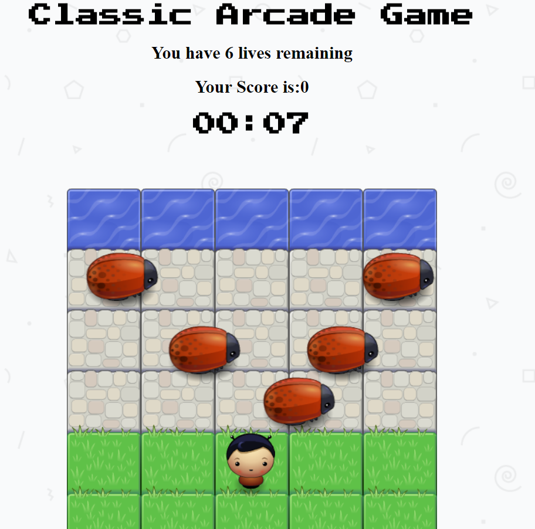
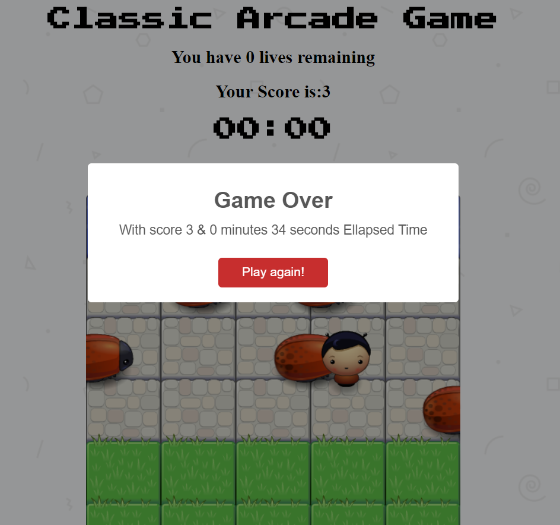
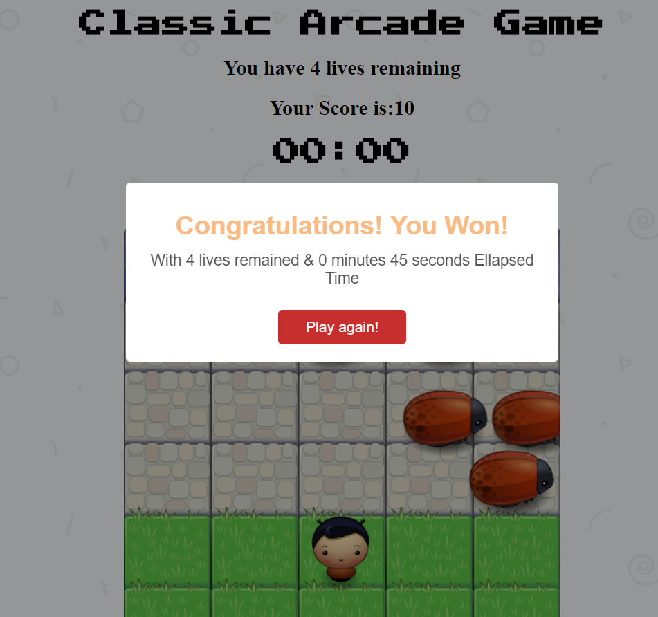

frontend-nanodegree-arcade-game
===============================

## when lose

## when win

### Attributions

Game engine.js and resources.js by <a href="https://www.udacity.com/">Udacity</a>

### Udacity's Instructions

-Students should use this [rubric](https://review.udacity.com/#!/projects/2696458597/rubric) for self-checking their submission

### How to play
- To play the game, use the arrow keys from your keyboard to move your player.

## Scoring
you one the game after reaching the water side for ten times with score = 10.
you lose the game after colliding with the enemy 6 times leading to losing your 6 lives .

### If you want to play
<a href="https://ayah2022.github.io/arcade-game/">Click here =')!</a>
